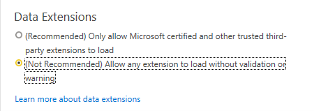
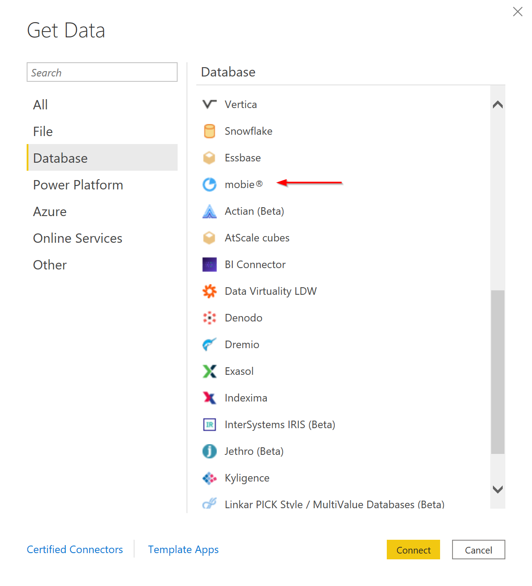
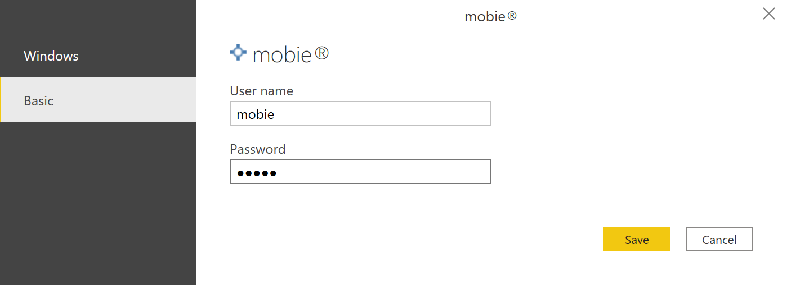
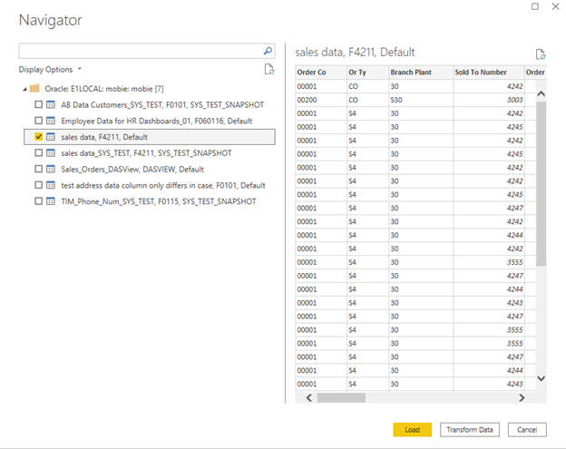

# mobie® Power BI Custom Connector

This document provides information on the use of the ReportsNow mobie custom connector for Microsoft Power BI. mobie produces snapshots of data from Data Access Studio into a database it manages called a DataBox.
This connector allows users to connect to specific snapshots of data by using the name of the Data Access Studio report that produced them and yielding data using column caption names defined in the original report.

If you simply wish to use the connector without building it yourself, you may download a pre-built version signed by ReportsNow from the releases section of this project:
https://github.com/ReportsNow/mobiePowerBIConnector/releases.

## Building the Connector

If you wish to build your own version of the connector as opposed to using the pre-built versions found in the releases section,
you will need the following prerequisites:

* A version of Visual Studio (build has only been validated on Visual Studio 2019).

* The WiX installer toolset (version 3.10 or higher) available from https://wixtoolset.org

* The PowerQuery SDK available from https://docs.microsoft.com/en-us/power-query/installingsdk

* The MakePQX tool for Power BI connector signing available from https://aka.ms/makepqx. The project files assume the location of MakePQX to be in C:\Tools\MakePQX, but this is configurable.

Steps to build the connector are as follows:

* Run the "GenerateCert.ps1" PowerShell script. This script will generate a self-signed code signing certificate to use in signing the connector and place it in your user certificate store.
It will prompt for the name of the certificate and a password to use for the CodeSigning.pfx file that is generated. Debug builds assume the password to be "test", though this can be specified differently.

* Run "msbuild mobie.sln" from a Visual Studio developer command prompt. If you placed the MakePQX executable somewhere other than C:\Tools\MakePQX, you will need to specify that path with the MakePQXPath build variable.
For example, "msbuild /p:MakePQXPath=C:\some\other\dir mobie.sln". If you specified a certificate file password other than "test" for a debug build, you will also need to specify the password with the
CertificatePassword build variable. For example, "msbuild /p:MakePQXPath=C:\some\other\dir /p:CertificatePassword=MyPassword mobie.sln".

The resulting connector can be found in mobie\bin\Debug\mobie.pqx and an installer to place it in the correct user directory can be found in Installer\bin\Debug\mobieConnector.msi.

## Installation

Two files are relevant for the installation:

* mobieConnector.msi
* TrustedThumbprint.ps1

The first is an MSI installer that can be used by users to place the mobie Custom Connector in the appropriate Power BI user connector folder. Because Power BI only allows Microsoft certified connectors
to load by default, there are two options for enabling the use of the connector:

1)	In Power BI security options (arrived at by going to “File->Options and settings->Options” and then selecting “Security”, change the “Data Extensions” setting to allow any extension:

2)	Use the TrustedThumbprint.ps1 PowerShell script to set a registry entry (HKEY_LOCAL_MACHINE\SOFTWARE\Policies\Microsoft\Power BI Desktop\TrustedCertificateThumbprints) to include the signing certificate
thumbprint of the connector. To do this, run ".\TrustedThumbprint.ps1 -SelfSigned true" from a PowerShell command prompt. If you obtained the pre-built version of the connector from ReportsNow signed with
the ReportsNow signing certificate, simply run ".\TrustedThumbprint.ps1" from a PowerShell command prompt and the ReportsNow certificate thumbprint ('1f1c059074762b49a97d6ce5c975a0a5e81bab5f') will be added.
Using the script to add the registry key is the preferred mechanism for trusting the connector, but does require administrative rights to edit the registry.

## Connecting to Data

In Power BI, the typical way to get data is to use the “Get Data” button. After installing the mobie connector, mobie will show up under the Database options:

Select mobie and click “Connect” to proceed. The following dialog will be presented:

In this dialog, options should be filled out as follows:

* Database Type: This indicates whether your DataBox database is Microsoft SQL Server or Oracle. (Both require that ADO.NET data providers have been installed for your database.)
* Server Name: This is the name used to connect to your database. In the case of SQL Server, this may include an instance name (e.g., MYSQLSERVER\INSTANCE). In the case of Oracle, this would often be the TNS name used to connect to your database.
* Database Name: For SQL Server, this is the name of the DataBox database. For Oracle, this is the name of the DataBox schema.
* Schema name: For SQL Server, this is typically just dbo, but may be an alternate schema name if the DataBox was created with a schema name other than dbo. For Oracle, this is the DataBox schema name.

The first time that you connect, you will also be asked for permissions to use to connect to the DataBox. This dialog looks something like this:

You can either use Windows credentials for SQL Server or Basic (user name and password authentication) for either SQL Server or Oracle. In either case, you need to supply credentials that have
the necessary permissions to access the DataBox database. Note that when using Data Access Studio and mobie, access to DataBox database data snapshots is controlled by the application. When using
this Power BI connector, access must be granted directly to the database to use the connector. Click on OK and you will be presented with a complete list of snapshots available in the specified DataBox database.
The names are listed in the form \<Report Name\>, \<Data Name\>, \<Snapshot Name\>:

From here, you can select a snapshot and load it (or transform it) as you would any other Power BI data source.

## Publishing and Refreshing Data

You can publish a Power BI report created using the mobie connector to the Power BI service for public consumption as you would with any other data source. If you wish to set it up for automatic refresh, you will need to use a Power BI on-premises Data Gateway (see https://powerbi.microsoft.com/en-us/gateway/). There is a personal mode gateway available for development and testing purposes as well as a standard mode gateway that runs as a service on a machine to connect to your mobie DataBox. The mobie Power BI connector must be installed on the Data Gateway machine and the Connectors directory needs to point to the directory where the custom connector is installed. In this manner, the Power BI service can be configured to connect to the Data Gateway to refresh the mobie data snapshot. Note that you will also have to enter credentials in the Power BI service for the Data Gateway to use to connect to the mobie DataBox database.
