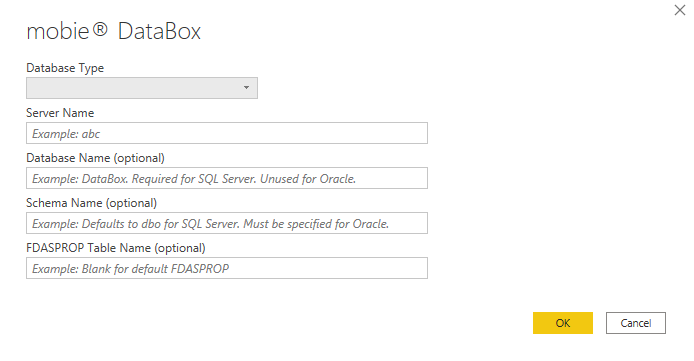
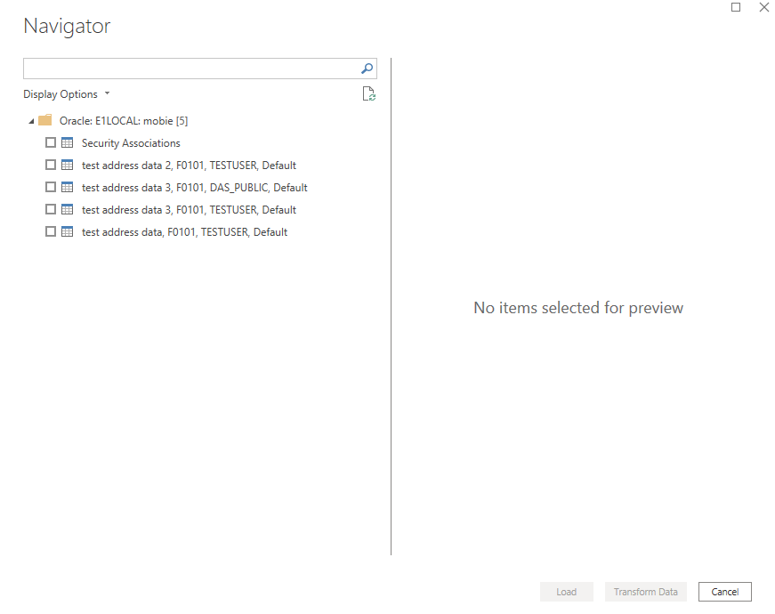

# mobie® Power BI Custom Connector

This document provides information on the use of the ReportsNow mobie custom connector for Microsoft Power BI. mobie produces snapshots of data from Data Access Studio into a database it manages called a DataBox.
This connector allows users to connect to specific snapshots of data by using the name of the Data Access Studio report that produced them and yielding data using column caption names defined in the original report.

If you simply wish to use the connector without building it yourself, you may download a pre-built version signed by ReportsNow from the releases section of this project:
https://github.com/ReportsNow/mobiePowerBIConnector/releases.

## Building the Connector

If you wish to build your own version of the connector as opposed to using the pre-built versions found in the releases section,
you will need the following prerequisites:

* A version of Visual Studio (build has only been validated on Visual Studio 2019).

* The WiX installer toolset (version 3.10 or higher) available from https://wixtoolset.org

* The PowerQuery SDK available from https://docs.microsoft.com/en-us/power-query/installingsdk

* The MakePQX tool for Power BI connector signing available from https://aka.ms/makepqx. The project files assume the location of MakePQX to be in C:\Tools\MakePQX, but this is configurable.

Steps to build the connector are as follows:

* Run the "GenerateCert.ps1" PowerShell script. This script will generate a self-signed code signing certificate to use in signing the connector and place it in your user certificate store.
It will prompt for the name of the certificate and a password to use for the CodeSigning.pfx file that is generated. Debug builds assume the password to be "test", though this can be specified differently.

* Run "msbuild mobie.sln" from a Visual Studio developer command prompt. If you placed the MakePQX executable somewhere other than C:\Tools\MakePQX, you will need to specify that path with the MakePQXPath build variable.
For example, "msbuild /p:MakePQXPath=C:\some\other\dir mobie.sln". If you specified a certificate file password other than "test" for a debug build, you will also need to specify the password with the
CertificatePassword build variable. For example, "msbuild /p:MakePQXPath=C:\some\other\dir /p:CertificatePassword=MyPassword mobie.sln".

The resulting connector can be found in mobie\bin\Debug\mobie.pqx and an installer to place it in the correct user directory can be found in Installer\bin\Debug\mobieConnector.msi.

## Installation

Two files are relevant for the installation:

* mobieConnector.msi
* TrustedThumbprint.ps1

The first is an MSI installer that can be used by users to place the mobie Custom Connector in the appropriate Power BI user connector folder. Because Power BI only allows Microsoft certified connectors
to load by default, there are two options for enabling the use of the connector:

1)	In Power BI security options (arrived at by going to “File->Options and settings->Options” and then selecting “Security”, change the “Data Extensions” setting to allow any extension:


2)	Use the TrustedThumbprint.ps1 PowerShell script to set a registry entry (HKEY_LOCAL_MACHINE\SOFTWARE\Policies\Microsoft\Power BI Desktop\TrustedCertificateThumbprints) to include the signing certificate
thumbprint of the connector. To do this, run ".\TrustedThumbprint.ps1 -SelfSigned true" from a PowerShell command prompt. If you obtained the pre-built version of the connector from ReportsNow signed with
the ReportsNow signing certificate, simply run ".\TrustedThumbprint.ps1" from a PowerShell command prompt and the ReportsNow certificate thumbprint ('1f1c059074762b49a97d6ce5c975a0a5e81bab5f') will be added.
Using the script to add the registry key is the preferred mechanism for trusting the connector, but does require administrative rights to edit the registry.

## Connecting to Data

In Power BI, the typical way to get data is to use the “Get Data” button. After installing the mobie connector, mobie will show up under the Database options:


Select mobie and click “Connect” to proceed. The following dialog will be presented:



In this dialog, options should be filled out as follows:

* Database Type: This indicates whether your DataBox database is Microsoft SQL Server or Oracle. (Both require that ADO.NET data providers have been installed for your database.)
* Server Name: This is the name used to connect to your database. In the case of SQL Server, this may include an instance name (e.g., MYSQLSERVER\INSTANCE). In the case of Oracle, this would often be the TNS name used to connect to your database.
* Database Name: For SQL Server, this is the name of the DataBox database. This is unused for Oracle.
* Schema name: For SQL Server, this is typically just dbo (and may be left blank to default to dbo), but may be an alternate schema name if the DataBox was created with a schema name other than dbo. For Oracle, this is the DataBox schema name.
* FDASPROP Table Name: Generally this can be left blank. If you are trying to use the connector with a test instance of Data Access Studio, this should be FDASPROPT.

The first time that you connect, you will also be asked for permissions to use to connect to the DataBox. This dialog looks something like this:


You can either use Windows credentials for SQL Server or Basic (user name and password authentication) for either SQL Server or Oracle. In either case, you need to supply credentials that have
the necessary permissions to access the DataBox database. Note that when using Data Access Studio and mobie, access to DataBox database data snapshots is controlled by the application. When using
this Power BI connector, access must be granted directly to the database to use the connector.

Beginning with release 1.0.0.3, it is recommended that you create specific database users for each of your mobie users that will be publishing and accessing data. The database user name
should match one of the user identities associated with that mobie user in the mobie administration interface. For example, if you have a mobie user called TESTUSER and that user has a simple
identity called TESTUSER associated with it, you would want to create a user called TESTUSER on your database. Windows user identities may also be used, particularly when using SQL Server.
The TESTUSER database user should only be granted SELECT permission to the FDASPROP table in the mobie DataBox database. Beginning with build 8.0.11.1 of Data Access Studio, when TESTUSER
publishes new data to the mobie DataBox, SELECT permission will also be granted to newly published data snapshots so that they are the only ones accessible to TESTUSER.

In order to retain the behavior of the connector prior to release 1.0.0.3 that would show all available snapshots published by all users, it is necessary to set a value in a table called rn__Options
in your mobie DataBox. See the release notes section below for details.

Click on OK and you will be presented with a list of snapshots available in the specified DataBox database.
The names are listed in the form \<Report Name\>, \<Data Name\>, \<Report Owner\>, \<Snapshot Name\>:



From here, you can select a snapshot and load it (or transform it) as you would any other Power BI data source.

Beginning with release 1.0.0.3, the names displayed have changed to include the \<Report Owner\>. Typically, this will either be your mobie user name or the name DAS_PUBLIC to reference
published reports. This change in name is necessary to be able to distinguish between a private and published report. Note that this change also breaks Power BI reports built using older
versions of the connector, but the fix is simple: simply edit the query associated with your existing report snapshot and include the \<Report Owner\> in the referenced name.

## Publishing and Refreshing Data

You can publish a Power BI report created using the mobie connector to the Power BI service for public consumption as you would with any other data source. If you wish to set it up for automatic refresh, you will need to use a Power BI on-premises Data Gateway (see https://powerbi.microsoft.com/en-us/gateway/). There is a personal mode gateway available for development and testing purposes as well as a standard mode gateway that runs as a service on a machine to connect to your mobie DataBox. The mobie Power BI connector must be installed on the Data Gateway machine and the Connectors directory needs to point to the directory where the custom connector is installed. In this manner, the Power BI service can be configured to connect to the Data Gateway to refresh the mobie data snapshot. Note that you will also have to enter credentials in the Power BI service for the Data Gateway to use to connect to the mobie DataBox database.

## Implementing mobie Defined Row Level Security

When connecting to a mobie DataBox, one table that you can load is a "Security Associations" table. This table has one column called Identity and one column for every security association defined in the
mobie administration interface. The table contains one row for every mobie identity and the value for the associated mobie user's security associations in the columns for that row. If there are multiple identities
for a single mobie user, there will be a row for each identity with the security association values duplicated for each identity. An example of this table can be seen below:


This table can be used to implement dynamic row level security in your Power BI visualization. For example, you may wish to restrict a user to seeing only data where a Company column matches the Company security
association of the logged in user. To do this, use the "Manage relationships" dialog available from the Modeling tab in Power BI. In this dialog, create a new relationship with the "Security Associations" table
and the desired data table. Select the Company column in both and pick the "Cross filter direction" to be "Single" from the "Security Associations" table to the data table. Note that the cardinality of this
relationship will be many-to-many and you will want to make sure that the relationship is active. An example of creating this relationship is shown below:


Next, you will want to "Manage roles" (also from the Modeling tab) in Power BI. Here you will want to create a new role with the DAX expression of "[Identity] = USERPRINCIPALNAME()". You might call this role
"Company Security". This definition is shown below:


Now, when you publish your visualization, you also want to assign this role to any users that you publish the visualization to. In this way, it will look up their user principal name
and match it up with the Identity column in the Security Associations table. Because there is a cross filtering relationship between the Security Associations table and your data table, the contents of the
data table will also be filtered. Note that specifying User Principal Names (UPN) is only available in Data Access Studio beginning with build 8.0.11.1.

## Release Notes

### Release 1.0.0.3

* **Breaking change**: Navigation names used by the connector now include the \<Report Owner\> as part of the comma separated name to distinguish between versions of a report name owned by different users. Published reports use the name DAS_PUBLIC for the report owner. When first opening existing Power BI files with connections to mobie snapshots prior to this release, edit the query and include the report owner name in the comma separated name.
* Security Associations table included as a mechanism to implement dynamic row level security in your Power BI report.
* Support ability to connect to FDASPROPT test table.
* Improve error checking of incoming options and make parameters optional that are not always required.
* By default, users only see snapshots that they have published themselves to the mobie DataBox. To retain the past behavior of seeing all snapshots, it is necessary to create a table called rn__Options. See below for instructions.
The table and access to it are only required if you wish to retain the legacy behavior.

#### Instructions for creating rn__Options table

Note that if you create user based permissions to your mobie database/schema, connecting users will also require SELECT permission to the rn__Options table.

For SQL Server, you may run the following script (substituting your DataBox database name for MyDataBoxDatabase:

```
   USE [MyDataBoxDatabase]
   GO
   SET ANSI_NULLS ON
   GO
   SET QUOTED_IDENTIFIER ON
   GO
   CREATE TABLE [dbo].[rn__Options](
	   [Name] [nvarchar](32) NOT NULL,
	   [ReportUniqueName] [nvarchar](275)  NOT NULL,
	   [Value] [nvarchar](256) NOT NULL,
    CONSTRAINT [PK_rn__Options] PRIMARY KEY CLUSTERED 
   (
	   [Name] ASC,
	   [ReportUniqueName] ASC
   )WITH (PAD_INDEX = OFF, STATISTICS_NORECOMPUTE = OFF, IGNORE_DUP_KEY = OFF, ALLOW_ROW_LOCKS = ON, ALLOW_PAGE_LOCKS = ON, OPTIMIZE_FOR_SEQUENTIAL_KEY = OFF) ON [PRIMARY]
   ) ON [PRIMARY]
   GO
   INSERT [dbo].[rn__Options] ([Name], [ReportUniqueName], [Value]) VALUES (N'PowerBIShowAllTables', '', N'1')
   GO
```

The value of 1 for PowerBIShowAllTables will cause all snapshots to be shown in the navigation interface. Any other value will retain the default behavior.

For Oracle, you may run the following script (this assumes that the mobie DataBox schema is named "MOBIE"):

```
  CREATE TABLE "MOBIE"."RN__OPTIONS" 
   (	"NAME" VARCHAR2(32 BYTE), 
	"REPORTUNIQUENAME" VARCHAR2(275 BYTE), 
	"VALUE" VARCHAR2(256 BYTE)
   )

  CREATE UNIQUE INDEX "MOBIE"."RN__OPTIONS_PK" ON "MOBIE"."RN__OPTIONS" ("NAME", "REPORTUNIQUENAME") 

  ALTER TABLE "MOBIE"."RN__OPTIONS" ADD CONSTRAINT "RN__OPTIONS_PK" PRIMARY KEY ("NAME", "REPORTUNIQUENAME")
  ALTER TABLE "MOBIE"."RN__OPTIONS" MODIFY ("VALUE" NOT NULL ENABLE);
  ALTER TABLE "MOBIE"."RN__OPTIONS" MODIFY ("REPORTUNIQUENAME" NOT NULL ENABLE);
  ALTER TABLE "MOBIE"."RN__OPTIONS" MODIFY ("NAME" NOT NULL ENABLE);

  INSERT INTO "MOBIE"."RN__OPTIONS" (NAME, REPORTUNIQUENAME, VALUE) VALUES ('PowerBIShowAllTables', ' ', '1')
```

### Release 1.0.0.2
Initial version
